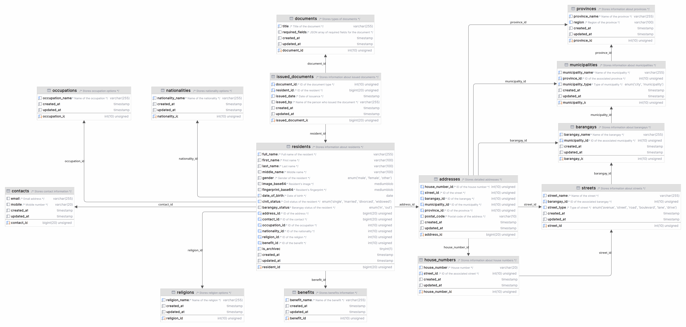

# Backend SQL Schema Documentation

This documentation provides an in-depth overview of the database schema used in our application. It outlines the structure and relationships of each table, ensuring data integrity and supporting efficient data management.

## Table: `residents`
This table stores information about residents.

| Field             | Type                  | Description                            |
|-------------------|-----------------------|----------------------------------------|
| `resident_id`     | `bigint(20) unsigned` | Unique identifier for the resident. Auto-increments and serves as the primary key. |
| `full_name`       | `varchar(255)`        | Full name of the resident. Cannot be null. |
| `first_name`      | `varchar(100)`        | First name of the resident. Cannot be null. |
| `last_name`       | `varchar(100)`        | Last name of the resident. Cannot be null. |
| `middle_name`     | `varchar(100)`        | Middle name of the resident.            |
| `gender`          | `enum('male', 'female', 'other')` | Gender of the resident. Cannot be null. |
| `image_base64`    | `mediumblob`          | Base64 encoded image of the resident.  |
| `fingerprint_base64` | `mediumblob`       | Base64 encoded fingerprint of the resident. |
| `date_of_birth`   | `date`                | Date of birth of the resident. Cannot be null. |
| `civil_status`    | `enum('single', 'married', 'divorced', 'widowed')` | Civil status of the resident. Cannot be null. |
| `barangay_status` | `enum('in', 'out')`   | Barangay status of the resident. Cannot be null. |
| `contact_id`      | `bigint(20) unsigned` | Foreign key to the `contacts` table.   |
| `address_id`      | `bigint(20) unsigned` | Foreign key to the `addresses` table.  |
| `occupation_id`   | `int(10) unsigned`    | Foreign key to the `occupations` table.|
| `nationality_id`  | `int(10) unsigned`    | Foreign key to the `nationalities` table. |
| `religion_id`     | `int(10) unsigned`    | Foreign key to the `religions` table.  |
| `benefit_id`      | `int(10) unsigned`    | Foreign key to the `benefits` table.   |
| `is_archive`      | `tinyint(1)`          | Indicates if the resident's record is archived. |
| `created_at`      | `timestamp`           | Timestamp of when the record was created. Defaults to the current timestamp. |
| `updated_at`      | `timestamp`           | Timestamp of when the record was last updated. Defaults to the current timestamp on update. |

## Table: `documents`
This table stores different types of documents.

| Field             | Type                  | Description                            |
|-------------------|-----------------------|----------------------------------------|
| `document_id`     | `int(10) unsigned`    | Unique identifier for the document. Auto-increments and serves as the primary key. |
| `title`           | `varchar(255)`        | Title of the document. Cannot be null. |
| `required_fields` | `json`                | JSON array of required fields for the document. |
| `created_at`      | `timestamp`           | Timestamp of when the record was created. Defaults to the current timestamp. |
| `updated_at`      | `timestamp`           | Timestamp of when the record was last updated. Defaults to the current timestamp on update. |

## Table: `issued_documents`
This table stores information about issued documents.

| Field             | Type                  | Description                            |
|-------------------|-----------------------|----------------------------------------|
| `issued_document_id` | `bigint(20) unsigned` | Unique identifier for the issued document. Auto-increments and serves as the primary key. |
| `document_id`     | `int(10) unsigned`    | Foreign key to the `documents` table. Indicates the type of document issued. |
| `resident_id`     | `bigint(20) unsigned` | Foreign key to the `residents` table. Indicates the resident to whom the document was issued. |
| `issued_date`     | `date`                | Date when the document was issued.     |
| `issued_by`       | `varchar(255)`        | Name of the person who issued the document. |
| `created_at`      | `timestamp`           | Timestamp of when the record was created. Defaults to the current timestamp. |
| `updated_at`      | `timestamp`           | Timestamp of when the record was last updated. Defaults to the current timestamp on update. |

## Table: `addresses`
This table stores detailed address information.

| Field            | Type                  | Description                            |
|------------------|-----------------------|----------------------------------------|
| `address_id`     | `bigint(20) unsigned` | Unique identifier for the address. Auto-increments and serves as the primary key. |
| `house_number_id`| `int(10) unsigned`    | Foreign key to the `house_numbers` table. |
| `street_id`      | `int(10) unsigned`    | Foreign key to the `streets` table.    |
| `barangay_id`    | `int(10) unsigned`    | Foreign key to the `barangays` table.  |
| `municipality_id`| `int(10) unsigned`    | Foreign key to the `municipalities` table. |
| `province_id`    | `int(10) unsigned`    | Foreign key to the `provinces` table.  |
| `postal_code`    | `varchar(10)`         | Postal code of the address.            |
| `created_at`     | `timestamp`           | Timestamp of when the record was created. Defaults to the current timestamp. |
| `updated_at`     | `timestamp`           | Timestamp of when the record was last updated. Defaults to the current timestamp on update. |

## Table: `provinces`
This table stores information about provinces.

| Field          | Type                  | Description                            |
|----------------|-----------------------|----------------------------------------|
| `province_id`  | `int(10) unsigned`    | Unique identifier for the province. Auto-increments and serves as the primary key. |
| `province_name`| `varchar(255)`        | Name of the province. Cannot be null.  |
| `created_at`   | `timestamp`           | Timestamp of when the record was created. Defaults to the current timestamp. |
| `updated_at`   | `timestamp`           | Timestamp of when the record was last updated. Defaults to the current timestamp on update. |

## Table: `municipalities`
This table stores information about municipalities.

| Field              | Type                  | Description                            |
|--------------------|-----------------------|----------------------------------------|
| `municipality_id`  | `int(10) unsigned`    | Unique identifier for the municipality. Auto-increments and serves as the primary key. |
| `municipality_name`| `varchar(255)`        | Name of the municipality. Cannot be null. |
| `province_id`      | `int(10) unsigned`    | Foreign key to the `provinces` table.  |
| `created_at`       | `timestamp`           | Timestamp of when the record was created. Defaults to the current timestamp. |
| `updated_at`       | `timestamp`           | Timestamp of when the record was last updated. Defaults to the current timestamp on update. |

## Table: `barangays`
This table stores information about barangays.

| Field            | Type                  | Description                            |
|------------------|-----------------------|----------------------------------------|
| `barangay_id`    | `int(10) unsigned`    | Unique identifier for the barangay. Auto-increments and serves as the primary key. |
| `barangay_name`  | `varchar(255)`        | Name of the barangay. Cannot be null.  |
| `municipality_id`| `int(10) unsigned`    | Foreign key to the `municipalities` table. |
| `created_at`     | `timestamp`           | Timestamp of when the record was created. Defaults to the current timestamp. |
| `updated_at`     | `timestamp`           | Timestamp of when the record was last updated. Defaults to the current timestamp on update. |

## Table: `streets`
This table stores street information.

| Field          | Type                  | Description                            |
|----------------|-----------------------|----------------------------------------|
| `street_id`    | `int(10) unsigned`    | Unique identifier for the street. Auto-increments and serves as the primary key. |
| `street_name`  | `varchar(255)`        | Name of the street. Cannot be null.    |
| `created_at`   | `timestamp`           | Timestamp of when the record was created. Defaults to the current timestamp. |
| `updated_at`   | `timestamp`           | Timestamp of when the record was last updated. Defaults to the current timestamp on update. |

## Table: `house_numbers`
This table stores information about house numbers.

| Field            | Type                  | Description                            |
|------------------|-----------------------|----------------------------------------|
| `house_number_id`| `int(10) unsigned`    | Unique identifier for the house number. Auto-increments and serves as the primary key. |
| `house_number`   | `varchar(20)`         | The house number. Cannot be null.      |
| `street_id`      | `int(10) unsigned`    | Foreign key to the `streets` table.    |
| `created_at`     | `timestamp`           | Timestamp of when the record was created. Defaults to the current timestamp. |
| `updated_at`     | `timestamp`           | Timestamp of when the record was last updated. Defaults to the current timestamp on update. |

## Table: `contacts`
This table stores contact information for residents.

| Field          | Type                  | Description                            |
|----------------|-----------------------|----------------------------------------|
| `contact_id`   | `bigint(20) unsigned` | Unique identifier for the contact. Auto-increments and serves as the primary key. |
| `email`        | `varchar(255)`        | Email address of the resident. Cannot be null. |
| `mobile`       | `varchar(20)`         | Mobile number of the resident.         |
| `created_at`   | `timestamp`           | Timestamp of when the record was created. Defaults to the current timestamp. |
| `updated_at`   | `timestamp`           | Timestamp of when the record was last updated. Defaults to the current timestamp on update. |

## Table: `occupations`
This table stores the available occupation options for residents.

| Field             | Type                  | Description                            |
|-------------------|-----------------------|----------------------------------------|
| `occupation_id`   | `int(10) unsigned`    | Unique identifier for the occupation. Auto-increments and serves as the primary key. |
| `occupation_name` | `varchar(255)`        | Name of the occupation (e.g., "Teacher", "Engineer"). Cannot be null. |
| `created_at`      | `timestamp`           | Timestamp of when the record was created. Defaults to the current timestamp. |
| `updated_at`      | `timestamp`           | Timestamp of when the record was last updated. Defaults to the current timestamp on update. |

## Table: `nationalities`
This table stores the available nationality options for residents.

| Field              | Type                  | Description                            |
|--------------------|-----------------------|----------------------------------------|
| `nationality_id`   | `int(10) unsigned`    | Unique identifier for the nationality. Auto-increments and serves as the primary key. |
| `nationality_name` | `varchar(255)`        | Name of the nationality (e.g., "Filipino", "American"). Cannot be null. |
| `created_at`       | `timestamp`           | Timestamp of when the record was created. Defaults to the current timestamp. |
| `updated_at`       | `timestamp`           | Timestamp of when the record was last updated. Defaults to the current timestamp on update. |
